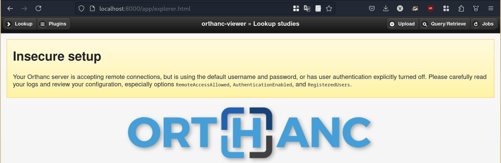
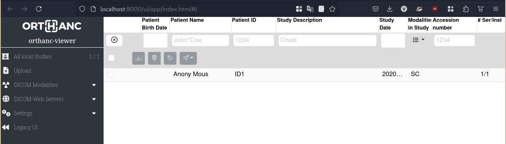
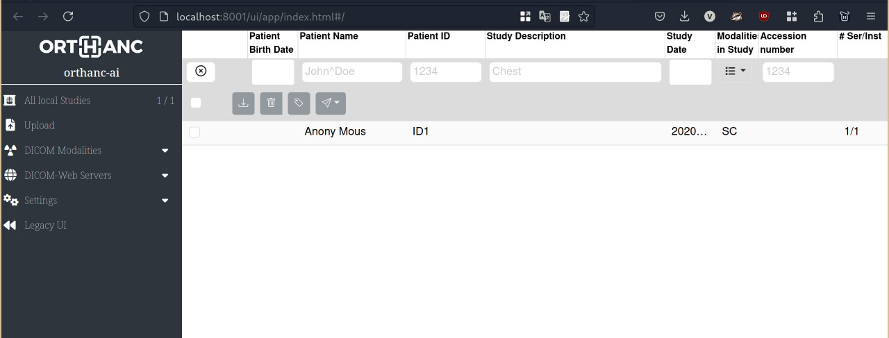
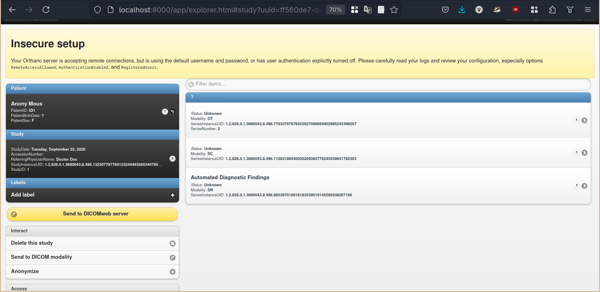
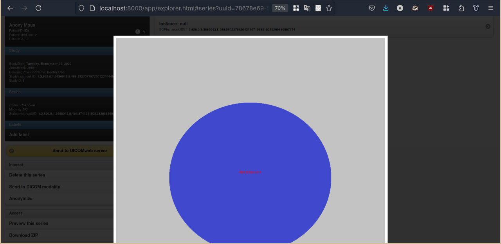
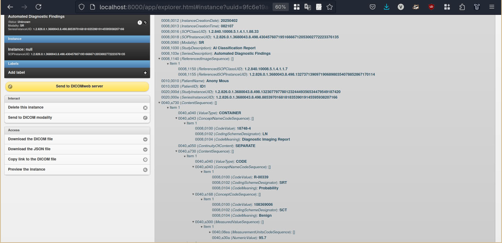

# Orthanc DICOM Routing with AI Integration

A demo project showcasing DICOM study routing between Orthanc servers, with automatic forwarding to an AI inference server when studies stabilize.

## Quick Test Guide
### 0. Clone and start containers
```bash
git clone https://github.com/Luab/orthanc-routing-example
cd orthanc-routing-example
docker-compose up --build
```
### 1. Upload Studies to Routing Server

Use the Orthanc Explorer web interface at http://localhost:8000/app/explorer.html#upload to upload DICOM studies.

  
*Web interface for uploading DICOM files*

---

### 2. Verify Study in Routing Server

1. Access Orthanc Explorer: http://localhost:8000/ui/app/index.html
  
*Studies list in Orthanc Viewer*

  
*Original series in Orthanc Viewer*

---

### 3. Check AI Server Reception

1. Access AI Orthanc: http://localhost:8001/ui/app/index.html#/
  
*Received studies in AI Orthanc*

2. Check processing status in the AI server interface.

### 4. Check acquired AI results

1. Two new processed studies

*Received mock AI results in Orthanc Viewer* 

2. Edited image sequence

*Received mock visual AI result in Orthanc Viewer* 


3. Structure report generated

*Received mock SR AI result in Orthanc Viewer* 
